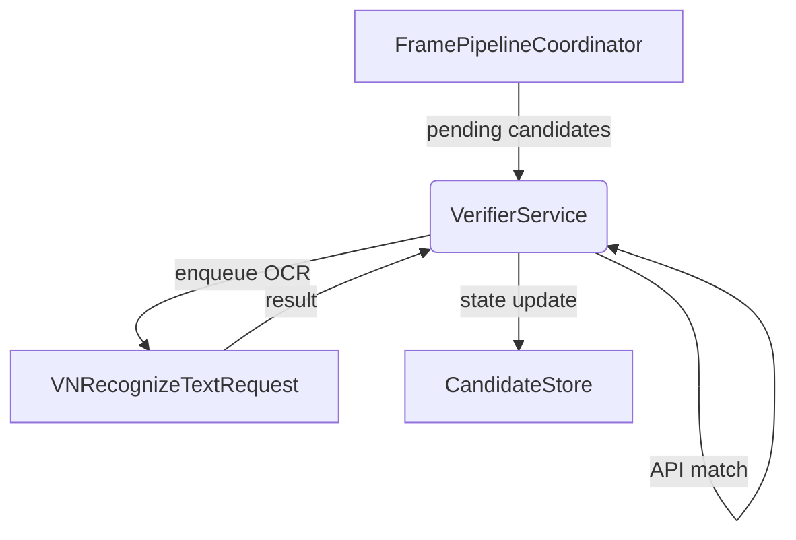

# License-Plate Secondary Verification

This document specifies the new pipeline feature that combines on-device OCR with the existing make / model / colour verification to robustly identify a user’s ride, even when the licence plate is intermittently visible.

## 1. User Story
A blind user is waiting for an Uber. The phone camera scans the street:
1. **Object detector** finds cars / trucks and begins tracking bounding-boxes (`Candidate`).
2. **LLM verification** (colour / make / model) approves or rejects candidates asynchronously.
3. **Plate OCR verification** tries to read a plate inside each approved bbox.  
   • If the plate matches the user-supplied string → *full match*  
   • If no plate is visible yet → *partial match* (keep tracking)  
   • If a clearly wrong plate is seen → *rejected*.
4. Navigation feedback speaks directions and final confirmation.

## 2. Data Model Changes
```swift
struct Candidate {
  var matchStatus: MatchStatus = .unknown    // see below
  var ocrAttempts: Int = 0                  // retry budget tracking
  var ocrText: String?                      // last recognised text
}

enum MatchStatus: String, Codable {
  case unknown    // no verification yet
  case waiting    // LLM verify in-flight
  case partial    // detector ok, plate not confirmed
  case full       // detector & plate confirmed
  case rejected   // wrong plate or retry exhausted
}
```

## 3. Configuration
```swift
struct VerificationConfig {
  let expectedPlate: String?                 // cleaned user input (ABC123)
  let regex = try! NSRegularExpression(     // validation when no expected plate
      pattern: "[A-Z0-9]{5,8}")
  let ocrConfidenceMin: Double = 0.6
  let maxOCRRetries: Int  = 2
  let cooldownAfterRejectSecs: TimeInterval = 5
}
```
The config is injected into services; UI can expose developer sliders later.

## 4. Description Parsing
```swift
let (plate, remainder) = DescriptionParser.extractPlate(from: userText)
config.expectedPlate = plate       // for OCR check
apiClient.prompt = remainder       // send only non-plate details to LLM
```
`extractPlate` uses the same regex, strips spaces / hyphens, and uppercases.

## 5. `VerifierService` (API + OCR)

Responsibilities:
1. **API phase**
   1. For each candidate whose `matchStatus == .unknown`, set status to `.waiting` and invoke the existing OpenAI API with make/model/colour prompt.
   2. If the API returns **match** → update to `.partial` and enqueue an OCR task.
   3. If the API returns **no-match** → remove the candidate (or mark `.rejected`).
2. **OCR phase** (runs on background queue)
   1. Crop the current frame using the candidate’s bounding box.
   2. Execute `VNRecognizeTextRequest`.
   3. Evaluate result table:
   | OCR outcome | Decision |
   |-------------|----------|
   | **No text** | remain `partial`; `ocrAttempts += 1`; retry until `maxOCRRetries` then age-out |
   | **Text & regex fail** | `rejected`; start cooldown |
   | **Confidence < min** | same as *No text* |
   | **Text == expectedPlate** | `full` |
   | **Regex pass (no expectedPlate)** | `full` |
4. Publish state changes via `CandidateStore.update` (main thread).

## 6. Coordinator Wiring
In `FramePipelineCoordinator` after step 6 (drift repair):
```swift
verificationService.process(
  pixelBuffer: buffer,
  orientation: orientation,
  store: candidateStore,
  imageSize: imageSize
)
```

## 7. Navigation Feedback
`NavigationManager.navigate()` gains a helper:
```swift
private func phrase(for cand: Candidate, dir: Direction) -> String {
  switch cand.matchStatus {
  case .full:
    if let plate = cand.ocrText { return "Found plate \(plate). \(dir.rawValue)" }
    return "Target confirmed. \(dir.rawValue)"
  case .partial:
    return "Object \(dir.rawValue). Plate not visible yet."
  default:
    return dir.rawValue
  }
}
```
Usage replaces hard-coded strings inside the existing timing guards.

## 8. Settings UI (optional)
Add an "Advanced" section:
* **Plate OCR Confidence** slider (0.3‒0.9)
* **OCR Retry Count** stepper (0‒5)
Visible only when `settings.developerMode == true`.

## 9. Test Matrix
| Scenario | Expected Speech |
|----------|-----------------|
| Plate visible immediately | "Found plate ABC123. Straight ahead" |
| Plate appears after 1 s | "Object straight ahead. Plate not visible yet" → then full message |
| Wrong plate | No full message; beeps stop after reject cooldown |
| No plate ever seen | Repeats partial cue; candidate expires silently |

## 10. Future Extensions
* Per-class verification thresholds → extend `VerificationConfig` with a dictionary.
* Other verifier types (barcode, QR) → add new enum cases, new strategy in `VerificationService`, no UI change required.
* Parallel verifier queue to avoid blocking when many candidates present.

---
*Last updated: 2025-07-17*
